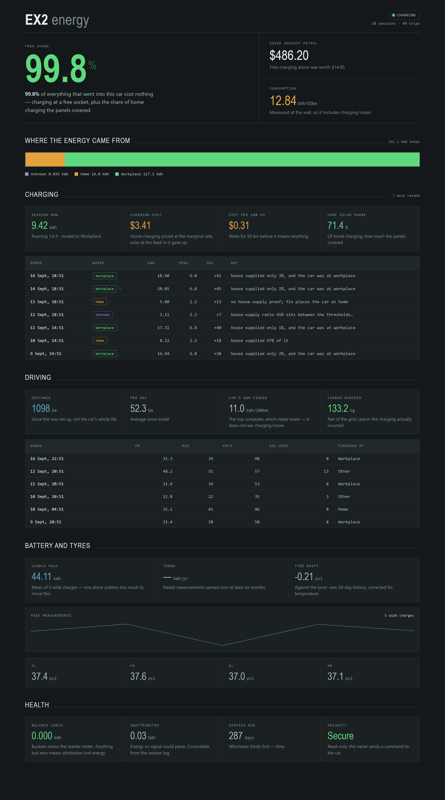
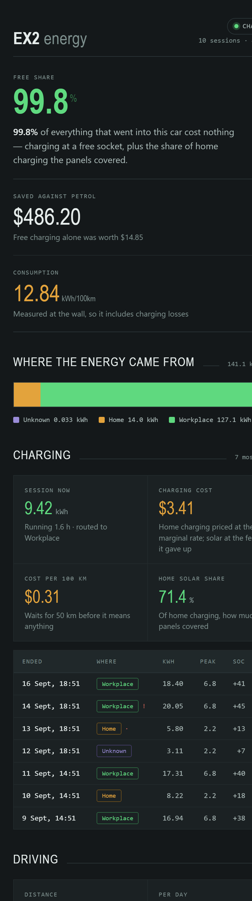

# EV Stats

**Where your EV charged, what it cost, and what it saved — with an answer for
every kilowatt-hour.**

[](https://github.com/shanehughes-ui/ha-ev-stats-integration/actions/workflows/validate.yml)
[](https://github.com/shanehughes-ui/ha-ev-stats-integration/actions/workflows/test.yml)
[](https://hacs.xyz)

Most EV energy tracking answers *how much*. This answers *where* — and then
holds itself to it. Every kilowatt-hour is filed against a place, the places
always sum to the meter, and there is a sensor whose only job is to prove that.



---

## Why this exists

A car charged at home costs money. The same car charged at a workplace socket
costs nothing. The same car charged on surplus solar costs the feed-in it gave
up, which is not zero and is not the import price either. None of that is
visible in a single "energy charged" figure, and getting it wrong is easy in a
way that never announces itself.

So this tracks a **ledger**, not a meter. Charging energy is filed into buckets
— home, each free-charging zone you configure, public DC, elsewhere, and
`unknown` — and the only operation that changes a bucket moves energy *between*
them, carrying its cost and its solar share with it under one lock.

Two invariants are asserted rather than hoped for:

- the buckets always sum to the total energy ever metered;
- no bucket ever goes negative.

The first is published as a sensor. If it ever leaves zero, attribution has
lost or invented energy and you will see it.

### `unknown` is a feature

Every kilowatt-hour lands in `unknown` unless something has *proven* where the
car was. Where the signals disagree, the verdict is `conflict` and the energy
stays unattributed.

That is deliberate. An honest "I do not know" is correctable with one service
call; a confident wrong answer is not, because nobody goes looking for it.

---

## How it decides

Two signals, chosen because they fail independently.

**The house-supply proof.** Did your own house meter actually consume the
energy the car says it took? Subtract a rolling median of what the house draws
when the car is idle, and what is left should be the car's share. This depends
on no location data at all, which is exactly why it is worth having.

**The GPS fix** — but only while it is provably fresh, and freshness is not an
age in minutes. A car parked for a week has a week-old position and it is
perfectly correct; what makes a fix untrustworthy is the car having *moved*
since. So each position is latched together with the odometer reading at the
moment it arrives, and counts as fresh only while the odometer still reads the
same.

Where they agree, the energy is filed immediately. Where they disagree, it is
not filed at all.

The classifier is a pure function with no Home Assistant import, so a case that
once went wrong is written down as six values and kept forever as a test rather
than reproduced by driving somewhere.

---

## Installation

### HACS (custom repository)

1. HACS → ⋮ → **Custom repositories**
2. Add `https://github.com/shanehughes-ui/ha-ev-stats-integration`, category
   **Integration**
3. Install, restart Home Assistant
4. **Settings → Devices & Services → Add Integration → EV Stats**

### Manually

Copy `custom_components/ev_stats/` into your `config/custom_components/` and
restart.

---

## What you need

**Four entities, and that is genuinely all:**

| | |
|---|---|
| Charging power | in kW. Every energy figure is integrated from this |
| Odometer | total distance |
| State of charge | battery percentage |
| Home zone | a `zone` entity |

Everything else is optional, and **each absent signal removes its own sensors
rather than publishing a zero**. That rule is load-bearing: a house-supply
ratio with no house meter behind it would read 0.00 and mean "charged somewhere
else", every single time.

| Add this | And you get |
|---|---|
| House load | the house-supply proof, and a classifier that does not lean on GPS |
| Solar output | solar share, and charging priced at the feed-in it gave up |
| Grid import price | cost, cost per 100 km, net saving |
| Free-charging zones | a bucket per zone, free share, what free charging was worth |
| Engine state | trips |
| Location tracker | trusted location, live routing |
| Grid carbon intensity | charging carbon, carbon avoided net of it |
| Fuel price | the petrol comparison, priced as the kilometres are driven |
| Tyre pressure + temperature | drift against the tyres' own history |
| Charge current / voltage | a socket fingerprint on each session |
| Locks, doors, windows | a read-only security summary |

---

## The dashboards

Both ship with the integration. Neither contains an entity id typed in by hand
— ids here are built from the device name, so a dashboard file with ids in it
would work on exactly one installation.

**The panel** appears in the sidebar as soon as you set it up. It runs inside
the Home Assistant frontend, so it is already authenticated as whoever is
looking at it — there is no long-lived token to paste anywhere and none to
leak. It works in the mobile app.



**A Lovelace view**, for people who want these figures beside the rest of their
house. Call `ev_stats.dashboard` and paste the YAML it returns into a
dashboard's raw configuration editor. Core cards only, so nothing has to be
installed first, and the view adapts to what you actually configured.

See [dashboards/README.md](dashboards/README.md).

---

## Services

| Service | What it does |
|---|---|
| `ev_stats.move_energy` | Move energy between buckets. Refuses rather than clamping if the source does not hold enough |
| `ev_stats.correct_session` | Refile a logged session. Moves its energy *and* restates what it cost — the same charge is free at a workplace and priced at home |
| `ev_stats.log_dc_session` | Attach what a public charge was billed. The energy is already metered; the price is the one figure nothing here can know |
| `ev_stats.dashboard` | Returns a Lovelace view as YAML. Writes nothing |
| `ev_stats.import_legacy` | Imports session, trip and pack logs from a YAML install. Idempotent. Logs only, never balances |

---

## Some things worth knowing

**Charging is priced provisionally.** The classifier cannot know where the car
is until a session has run the better part of an hour, and waiting would price
the first part of every home charge at zero. So every charge is priced as
though it were on your supply, and the session keeps or discards that figure at
the end. A correction restates it.

**Pack capacity is measured, not read.** The obvious sensor on most cars is
computed from the capacity that was configured, so it tells you nothing. But
any charge spanning 30% or more of the pack is an independent measurement, and
the published figure is the rolling mean of the recent few — real ones scatter
about 1.5% against a signal of roughly 2% a year. Ambient temperature is
recorded with each one, because a cold pack reads low with no degradation at
all.

**Tyres are reported as drift**, never pass or fail. No placard pressure exists
anywhere in most cars' data and the normalisation reference is arbitrary, so
the only honest comparison is with what these tyres have been doing themselves.

**Nothing is ever sent to the car.** The security summary is read-only by
design: a lock entity rendered on a dashboard is a button that unlocks it.

**Trip coordinates are off by default.** This ships dashboards meant to be
shared, and a home address is the most sensitive thing it could hold. Turn them
on if you want a route map, knowing what they record.

---

## Testing

```bash
python -m pytest tests -q        # the arithmetic and the judgement, no HA needed
python -m pytest tests_load -q   # does it load  (pip install pytest-homeassistant-custom-component)
```

The first suite deliberately imports no Home Assistant. The whole energy figure
rests on a few lines of trapezoidal integration and a decision table, and it
should be possible to check both without standing up a harness.

The second suite answers the question the first cannot. It found, the first
time it ran, that declaring `panel_custom` a hard dependency stopped the entire
integration setting up wherever the frontend did not.

---

## Upgrading from the YAML version

This grew out of a Home Assistant YAML package. If you ran that, call
`ev_stats.import_legacy` — it reads the session, trip and pack logs straight
out of the old template sensors' attributes and is safe to run twice.

It imports the **logs only, never the bucket balances**. Seeding those from the
same records would double-count against energy this integration has already
metered for itself, and there is no way to tell the two apart afterwards.

History does not carry across: the statistics belong to the old entity ids.

---

## Credits and licence

MIT. The idea of recording a solar share against every charging session is
borrowed from [evcc](https://github.com/evcc-io/evcc); the shape of the trip and
session logs owes a lot to
[TeslaMate](https://github.com/teslamate-org/teslamate).

The screenshots are rendered from [tools/preview.html](tools/preview.html),
which runs the real panel against sample data. Deliberately: the figures are
the measured ones from the system this grew out of, and nothing identifying —
no address, no zone name, no coordinate — has to exist in a public repository
to produce them.
